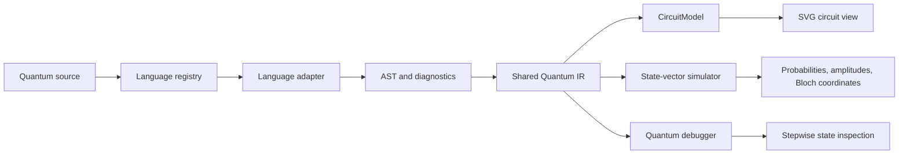

# QStudio

### A quantum development environment for learning, exploring, and building small quantum programs.

QStudio brings quantum programming, compiler diagnostics, circuit visualization, state-vector simulation, and quantum debugging into one Electron desktop workspace. It is designed for students, researchers, and developers who want to inspect what a quantum program means at each stage, from source code to circuit and simulated state.

> **Status:** early development (`0.1.0`). QStudio is a working prototype and a foundation for a broader quantum IDE. It is not a replacement for the official toolchains of the languages it accepts.

## Why QStudio?

Quantum programs are often split across an editor, a compiler, a circuit viewer, and a simulator. QStudio puts those feedback loops together:

- Edit quantum source in Monaco with language-aware highlighting, completion, hover help, formatting, and diagnostics.
- Compare several quantum-language syntaxes through a shared adapter model.
- Lower programs into a common **Quantum IR** so the same circuit and simulator tools can be reused.
- Inspect an AST, see the generated circuit, and step through intermediate simulated states.
- Work locally in a sandboxed Electron application, with AI assistance available as an optional provider integration.

QStudio is a good fit for small-circuit experimentation, language-adapter development, compiler prototyping, and quantum-computing education.

## Features

- **Quantum programming workspace:** Electron, React, TypeScript, Monaco Editor, and a Zustand application store.
- **Five language adapters:** Silq, OpenQASM 3.0, Microsoft Q#, Quil, and OpenQASM 2.0.
- **Compiler diagnostics:** Structured line and column diagnostics are shown in the editor and Problems panel.
- **Shared Quantum IR:** Language-specific parsers produce a common linear operation model.
- **Circuit visualization:** Interactive SVG wires, gate symbols, controls, CNOT targets, measurements, resets, and SWAP operations.
- **Small-circuit state-vector simulation:** Exact amplitudes, probabilities, sampled counts, state-vector output, and per-qubit Bloch coordinates for 1–12 qubits.
- **Quantum debugging:** Step forward, step back, continue, reset, breakpoints, and intermediate state inspection.
- **AST Explorer:** Select syntax-tree nodes and jump to their source ranges in the editor.
- **Local desktop integration:** Project folders, file access, and a restricted integrated terminal are exposed through a context-isolated preload bridge.
- **Optional AI assistance:** An OpenAI-compatible provider can explain, generate, translate, document, or help fix quantum source when configured.

## Supported Languages

QStudio currently supports documented grammar subsets for local IDE tooling. These adapters are not official implementations of Silq, Q#, Quil, or OpenQASM.

| Language     | Extensions        | Supported focus                                                                              |
| ------------ | ----------------- | -------------------------------------------------------------------------------------------- |
| Silq         | `.silq`           | Functions, qubit declarations, standard gates, controlled gates, measurement, and reset      |
| OpenQASM 3.0 | `.qasm`, `.qasm3` | Qubit/classical declarations, standard gates, measurement, reset, and barriers               |
| Microsoft Q# | `.qs`             | Namespaces, operations, qubit allocation, standard gates, measurement, reset, and `ResetAll` |
| Quil         | `.quil`           | Declarations, standard gates, measurement, and reset                                         |
| OpenQASM 2.0 | `.qasm`, `.qasm2` | Header/includes, registers, standard gates, measurement, reset, and barriers                 |

Language detection can use file extensions, source headers, or recognizable syntax. A language can also be selected manually in the editor.

For exact grammar details, see the [Compiler Guide](docs/CompilerGuide.md).

## Try a Bell State

The included Silq example creates a two-qubit Bell state:

```silq
fn bell() {
	let q = new Qubit[2];
	H(q[0]);
	X(q[1]).controlled(q[0]);
	return measure(q);
}
```

You can start with the included example at [examples/bell-state/bell-state.silq](examples/bell-state/bell-state.silq), or open QStudio and choose a Bell-state example from the welcome screen. The same circuit is also available in the OpenQASM 2.0, OpenQASM 3.0, Q#, and Quil adapter tests.

## How QStudio Works

The Silq compiler pipeline is:

```text
Source
	-> Lexer / tokenizer
	-> Parser and AST
	-> Semantic analysis
	-> Quantum IR
	-> OpenQASM output and CircuitModel
```

Other languages enter through `QuantumLanguageAdapter` implementations. Once lowered to `QuantumIR`, their programs can share the circuit visualizer, state-vector simulator, and quantum debugger.



Electron's main process owns filesystem dialogs and I/O. The renderer communicates with it through a narrow, context-isolated preload API. Compiler and simulation code currently runs locally with the renderer rather than through a remote service.

## Installation

### Prerequisites

- Node.js 20 or newer
- pnpm 9
- A desktop environment capable of running Electron for the full application

### Development setup

```bash
git clone https://github.com/amarpreet2982013-dev/QStudio.git
cd QStudio
pnpm install
pnpm dev
```

`pnpm dev` type-checks the Electron-side sources, starts the Vite development server, and launches Electron.

To build the production renderer and Electron process:

```bash
pnpm build
pnpm start
```

## Available Commands

| Command           | Purpose                                                          |
| ----------------- | ---------------------------------------------------------------- |
| `pnpm dev`        | Start the Vite development server and Electron                   |
| `pnpm start`      | Launch the built Electron application                            |
| `pnpm build`      | Type-check and create the production renderer/main-process build |
| `pnpm test`       | Run the Vitest unit-test suite                                   |
| `pnpm test:watch` | Run Vitest in watch mode                                         |
| `pnpm test:e2e`   | Build and run the Playwright Electron smoke test                 |
| `pnpm lint`       | Run ESLint with zero warnings configured                         |
| `pnpm format`     | Format repository files with Prettier                            |

## Testing

The test suite currently covers:

- Silq compiler parsing, diagnostics, IR lowering, and OpenQASM generation
- Language registration and source detection
- OpenQASM 2.0, OpenQASM 3.0, Q#, and Quil adapter subsets
- Cross-language Bell-state equivalence
- State-vector gates, reset, probabilities, Bloch coordinates, and small performance cases
- Quantum debugger stepping
- An Electron window smoke test through Playwright

Run the main checks with:

```bash
pnpm lint
pnpm exec tsc -p tsconfig.json --noEmit
pnpm exec tsc -p tsconfig.app.json --noEmit
pnpm test
pnpm build
```

The optional Electron smoke test is run with `pnpm test:e2e` and requires an environment where Electron can launch a desktop window.

## Current Limitations

### Simulator scope

The simulator is intended for small circuits and supports 1–12 qubits. It is a local state-vector simulator, not a hardware backend and not a performance-oriented large-scale simulator. Measurement operations now perform projective collapse and record per-run outcomes, while repeated shots are executed independently for aggregate counts. Classical-register destinations and richer classical control semantics are not yet represented in the shared IR.

The quantum debugger replays prefixes of the compiled IR and does not connect to real quantum hardware.

### Language scope

Adapters intentionally support documented subsets rather than complete language specifications. Unsupported areas include, depending on the language, arbitrary classical control flow, user-defined gates, advanced type systems, custom Q# project references, Quil defgate expressions, and arbitrary parameterized gates. See [docs/CompilerGuide.md](docs/CompilerGuide.md) for the per-language scope.

### Product scope

Hardware execution interfaces, the project indexer, extension host, settings service, and AI provider are foundational APIs or partial integrations rather than complete product workflows. AI assistance requires an OpenAI-compatible endpoint and environment variables; it is optional and not required for local compilation, visualization, simulation, or debugging.

## Roadmap

The repository is building toward a more complete quantum IDE. High-value next steps include:

- More expressive Quantum IR with register identity, classical data, dependencies, and stronger source mapping
- Broader classical-result and control-flow semantics in the shared IR
- Broader and more rigorous language-subset coverage
- Shared compiler services that can move out of the renderer when needed
- Integrated project indexing, save workflows, settings, and extension lifecycle support
- Hardware-provider integrations with explicit credentials and execution workflows
- More renderer and Electron integration coverage

The roadmap describes direction, not features currently promised by this release.

## Contributing

Contributions are welcome, especially around compiler correctness, language adapters, simulator semantics, diagnostics, tests, and developer documentation.

Before opening a pull request:

1. Keep changes focused and explain the behavior being changed.
2. Add or update tests for compiler, adapter, simulator, or UI behavior as appropriate.
3. Run the TypeScript checks, unit tests, and production build.
4. Update the relevant documentation when public behavior changes.

Useful starting points:

- [Architecture](docs/Architecture.md)
- [Compiler Guide](docs/CompilerGuide.md)
- [Multi-language Architecture](docs/MultiLanguageArchitecture.md)
- [Simulator Guide](docs/SimulatorGuide.md)
- [API Guide](docs/API.md)
- [Developer Guide](docs/DeveloperGuide.md)
- [Extension Guide](docs/ExtensionGuide.md)

## License

No `LICENSE` file is currently included in the repository. Licensing terms should be clarified before redistribution or external contribution programs are established.

## Disclaimer

QStudio is an experimental open-source quantum development environment. It is intended for education, research prototyping, and software development. It does not provide access to quantum hardware, does not claim conformance with the full specifications of the supported languages, and should not be used as a substitute for official language toolchains or production validation.
